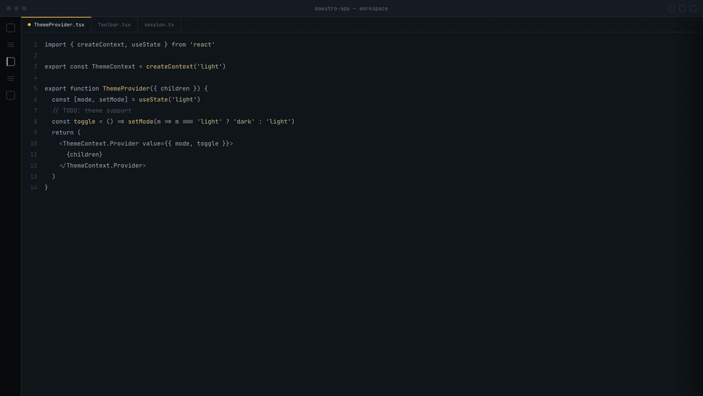

# Maestro

Conduct a team of AI coding agents in isolated git worktrees, without leaving VS Code.

Maestro dispatches agents to your own engine CLIs (GitHub Copilot, Gemini/ACP), watches them stream on one board, and lets you review each agent's diff before anything merges. Because it drives each engine's CLI, it reuses that tool's existing login. No API key.

> Pre-release (working name, extension `v0.1.10`). The orchestration core is built and tested: 8 packages, 1609 tests, installable from a VSIX.

## Demo

<!-- For the VS Code Marketplace listing, swap this relative path for the absolute raw URL
     https://raw.githubusercontent.com/norequest/maestro-vscode/main/docs/media/demo.gif
     (the Marketplace does not resolve relative paths). See docs/PUBLISHING.md. -->


## Features

- Model-agnostic. The orchestration brain is engine-neutral; engines plug in behind one small adapter.
- Reuses your existing login. Each engine runs as its own CLI subprocess, so Maestro never touches your API keys.
- Two engine families: GitHub Copilot CLI and any ACP engine (drives `gemini --acp --stdio`).
- Real isolation. By default every agent works in its own `git worktree` on its own branch, so parallel agents never collide.
- Review before merge. A finished agent is a diff to review, not a surprise commit. Merge, discard, send back with feedback, or open a PR.
- Copilot fleet teams. A Copilot-led team can run as one shared session that dispatches named teammates in-context, for one combined diff.
- Editor-native. The board, the agent library, and diff review all live in one VS Code panel.

## Requirements

- VS Code `^1.90.0`
- A git repository open as your workspace folder.
- At least one engine CLI on your `PATH`:
  - GitHub Copilot CLI (`copilot`), or
  - Gemini CLI (`gemini`) for the ACP engine.
- `git` for worktrees. For PR mode, the GitHub CLI (`gh`).

## Quick start

1. Install the packaged VSIX (Maestro is not on the Marketplace yet):
   ```bash
   code --install-extension packages/extension/maestro-<version>.vsix
   ```
2. Open a folder that is a git repository.
3. Click the Maestro icon in the activity bar to open the Conducting Board (or run "Maestro: Open Conducting Board").
4. Dispatch an agent: pick a role, write the task, and send it. The agent gets a fresh worktree and streams live on the board.
5. When it finishes, open the diff and Merge, Discard, or Send back with feedback. With PR mode on, open a pull request instead.

Roles, teams, and skills live in a `.conductor/` directory in your workspace, which Maestro scaffolds on first run.

## Learn more

See [`docs/DEVELOPMENT.md`](docs/DEVELOPMENT.md) for the architecture and how to build, test, and package Maestro, and [`docs/PUBLISHING.md`](docs/PUBLISHING.md) for the Marketplace release process.

<details>
<summary>Concepts and engine modes</summary>

### Concepts

- Agent: one running engine working on one task. On the board it is a card.
- Role: a reusable agent definition (engine, instructions, tools, skills, soul, autonomy). Lives in `.conductor/roles/`.
- Team: a named group of roles with a designated lead. Lives in `.conductor/teams/`.
- Skill: a reusable instruction packet you can attach to a role.
- Soul: an optional persona document a role references.
- Worktree: the isolated `git worktree` (its own branch) an agent works in.
- Engine: the CLI Maestro drives (GitHub Copilot, or any ACP engine such as Gemini), behind one adapter contract.
- Autonomy: how much an agent may do without asking. `manual`, `auto-approve-safe`, or `yolo`.

### Engines and modes

| Engine id | Used for | Isolation |
| --- | --- | --- |
| `copilot` | A single Copilot agent, or an isolated team | One `git worktree` and branch per agent. Each agent has its own diff. |
| `copilot-fleet` | A team whose lead engine is Copilot | One shared session. Named teammates run as in-session sub-agents and share the conductor's worktree. You review one combined diff. |
| `acp` | A single Gemini/ACP agent, or an ACP team | One `git worktree` and branch per agent. |

Trade-off: fleet gives you one shared context and one combined diff. Isolated mode gives every agent its own worktree and its own reviewable diff. Single-agent dispatch and ACP teams always use isolated worktrees.

### Settings (search "Maestro" in VS Code Settings)

- `maestro.prMode`: create a pull request (push branch + `gh pr create`) instead of a local merge. Default `false`.
- `maestro.prDraft`: open pull requests as drafts when PR mode is on. Default `false`.
- `maestro.discoverPlugins`: scan installed Copilot plugins during discovery. Default `false`.

`config.yaml` in `.conductor/` controls workspace defaults, including `maxParallelAgents` (how many agents run at once; the rest queue).

</details>

## License

MIT. See [LICENSE](LICENSE).
